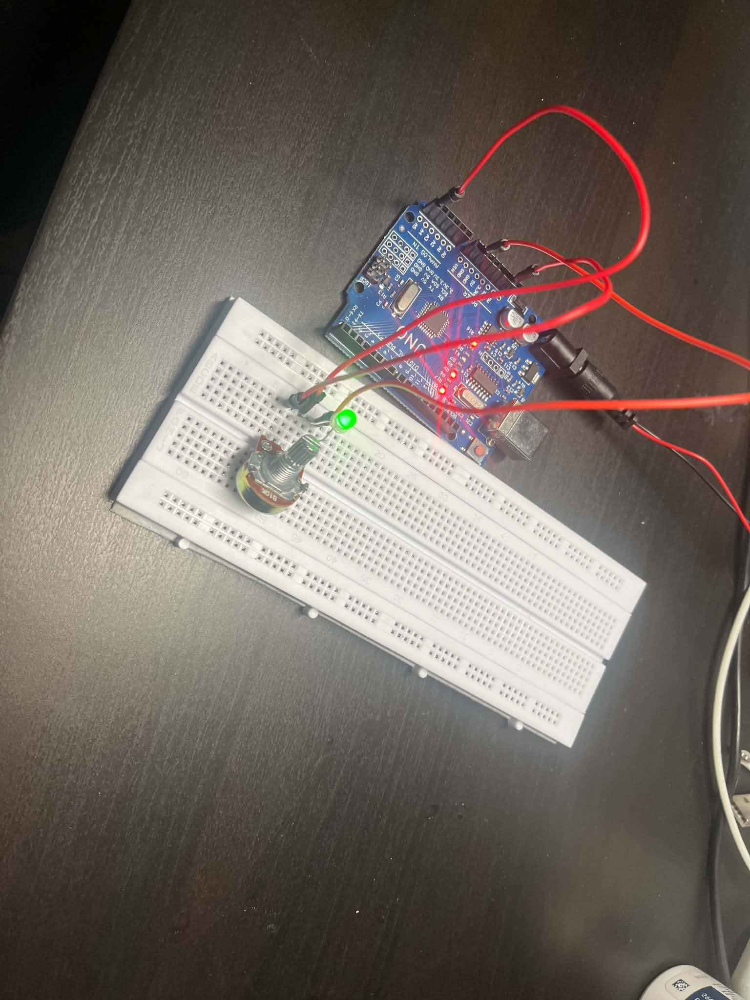

# Light Controller (Arduino)

A simple Arduino UNO project that controls a green LED light using a potentiometer (variable resistor).

---

## 🛠 Hardware Required

Based on the actual circuit setup:
* **1x** Arduino UNO R3
* **1x** Green LED
* **1x** Potentiometer (10kΩ)
* **1x** Resistor (for LED current limiting)
* **1x** Breadboard
* Jumper Wires & USB Power Cable

---

## 🔌 Circuit Diagram & Wiring

Here is the hardware setup for this project:

### Pin Connections:
* **Potentiometer:**
  * Left Pin: Connected to Ground (`GND`)
  * Right Pin: Connected to Power (`5V`)
  * Middle Pin (Signal): Connected to Analog Pin `A0`
* **Green LED:**
  * Anode (+): Connected through a resistor to a Digital/PWM Pin
  * Cathode (-): Connected to Ground (`GND`)

---

## 🚀 How to Run the Code

1. **Download the Repository:**
   Clone or download this repository to your computer.
2. **Open the Project:**
   Launch the **Arduino IDE**, then go to `File` -> `Open` and select `LightController/LightController.ino`.
3. **Upload the Code:**
   * Connect your Arduino UNO to your computer using the USB cable.
   * Select the board: **Tools** -> **Board** -> **Arduino Uno**.
   * Select the port: **Tools** -> **Port** -> (Choose your COM port).
   * Click the **Upload** button (`➔`).

---

## 📝 How It Works
* Rotating the potentiometer changes the voltage sent to Analog Pin `A0`.
* The Arduino reads this analog value and adjusts the LED status/brightness accordingly.
